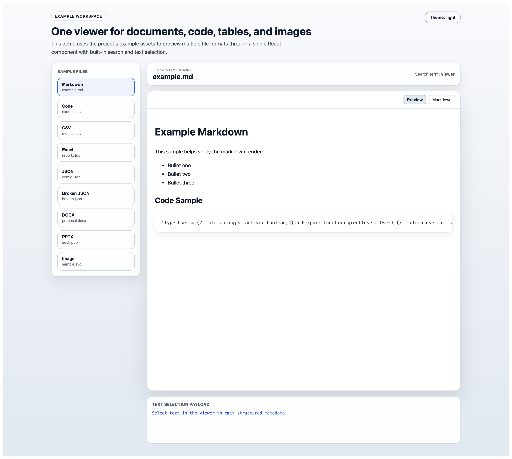
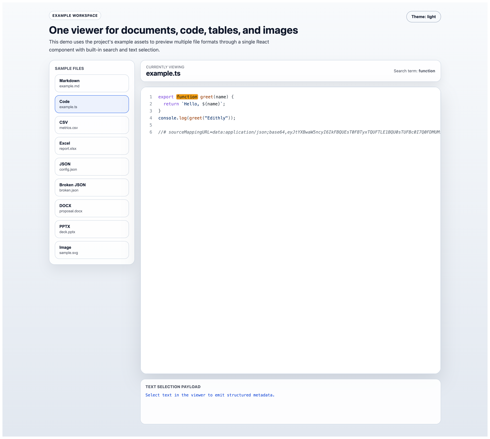
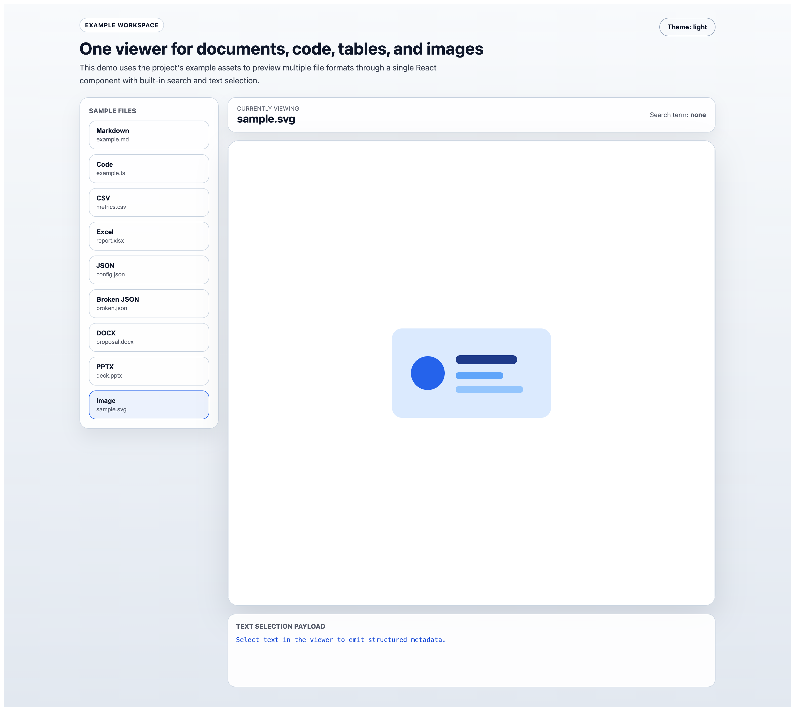

# One Viewer for Every File: A Better Story for React Apps



There is a moment almost every product team runs into.

Someone uploads a PDF. Then someone else opens a spreadsheet. A support agent needs to inspect a log file. A reviewer wants to check a DOCX attachment. An engineer clicks into JSON. A designer drops in an SVG. Suddenly one small “preview this file” feature turns into a scattered collection of viewers, custom conditions, and inconsistent user experiences.

That is exactly why this project feels valuable.

`@smazeeapps/file-viewer` is built around a simple promise: one viewer for all your files. Not one viewer for PDFs and a second one for code and a third one for images. One React component that can sit inside your product and handle the everyday reality of modern file workflows.

Package URL: https://www.npmjs.com/package/@smazeeapps/file-viewer
GitHub URL: https://github.com/smazeestudio/edithly-file-viewer

Instead of making your app juggle different preview experiences, this package gives you a single `FileViewer` component and lets the file itself shape the rendering experience through `fileName`. The result is cleaner product code, a more unified interface, and far less friction for the people actually using the app.

## It starts with a very familiar problem

Most teams do not plan to build a file platform.

They start with one small use case. Maybe it is a proposal viewer in a client portal. Maybe it is a support tool that needs to inspect CSV exports. Maybe it is an internal dashboard where users open logs, markdown notes, JSON payloads, and screenshots in the same workflow.

At first, it sounds manageable.

Then the formats keep growing.

The UI starts splitting.

Search works in one place but not another. Images open differently from documents. Code previews feel disconnected from office files. Every new format adds another branch in the logic and another edge case in the interface.

That is where the idea of a single viewer becomes more than a convenience. It becomes a product decision.

## One component, many file experiences

What makes this extension compelling is how small the integration surface stays, even while the capabilities are broad.

If you want to try it quickly, the install is simple:

```bash
npm install @smazeeapps/file-viewer react react-dom
```

```tsx
import { FileViewer } from "@smazeeapps/file-viewer";

export function PreviewPanel() {
  return (
    <FileViewer
      src="https://example.com/files/report.pdf"
      fileName="report.pdf"
      height="800px"
      theme="light"
    />
  );
}
```

That is the promise in its simplest form.

You give the component a source and a file name. The viewer takes care of the rest. It detects the file type, loads the right rendering path, and keeps the experience inside the same product surface. For teams building real applications, that kind of consistency is hard to overvalue.

## The experience feels unified because it is unified

The biggest win here is not just that many file types are supported. It is that they are supported through one mental model.

- one `FileViewer` API
- one consistent embedding pattern in your app
- one place for search
- one place for selection
- one place for theming
- one place for previewing documents, text, code, data, and images

That is what makes the extension feel less like a bundle of viewers and more like a true file experience layer for React apps.

## Search is part of the story, not an afterthought

When people open files inside products, they usually are not browsing casually. They are trying to find something.

A phrase in a contract. A value in a JSON payload. A function in a code file. A line in a markdown note.

This is why built-in search matters so much.

The viewer supports keyboard-triggered search through `Ctrl+F` and `Cmd+F`, which already makes it feel natural inside a browser-based workflow. On top of that, product teams can drive search from outside the component with `searchMode`, which is a strong fit for global search experiences, guided review flows, and workflow-driven inspection tools.



That small detail changes the tone of the whole component. It stops being just a renderer and starts becoming an active part of how users work through files.

## Selection makes the viewer feel connected to the product

Another part of the story is text selection.

Many preview components stop at “show the file.” This one goes a step further. With `onTextSelect`, the parent application can receive structured information about what the user selected inside the viewer.

That opens the door to:

- review workflows
- annotations
- citations
- support investigation tools
- document intelligence experiences
- internal audit and compliance flows

When a viewer can pass meaningful selection metadata back to the app, it starts acting less like a static preview and more like a real product surface.

That can look like this in practice:

```tsx
<FileViewer
  src={file}
  fileName={file.name}
  fileId={`sample:${file.name}`}
  onTextSelect={(payload) => {
    console.log(payload);
  }}
/>
```

Example payload:

```json
{
  "file_name": "example.ts",
  "file_id": "sample:example.ts",
  "text": "function greet(name)",
  "page_number": 1,
  "line_number": "1"
}
```

## Images belong in the same viewer too

Image support is one of those things that sounds secondary until you are building an actual product.

Real workflows do not separate everything neatly. A team may need to review a DOCX file, then a screenshot, then a CSV, then a markdown note, then an SVG asset. If images have to open in a completely separate experience, the product starts feeling fragmented again.

That is why the image support here matters. Formats like `png`, `jpg`, `jpeg`, `gif`, `webp`, `svg`, `bmp`, and `ico` can live inside the same viewer flow as the rest of the product.



That is the bigger story of this package: it helps your app stay whole.

## Features that make the single-viewer promise real

The “single viewer for all files” message works because there is real product thinking behind it. The extension includes:

- a single `FileViewer` component API
- support for remote file URLs
- support for local browser `File` objects
- automatic file-type detection from `fileName`
- lazy-loaded format-specific viewers
- keyboard-triggered search with `Ctrl+F` / `Cmd+F`
- parent-driven search with `searchMode`
- text selection callbacks through `onTextSelect`
- light and dark theme support
- TypeScript types for React integration
- one browser-based preview flow for documents, code, data, text, and images
- a safe unsupported-file fallback

Every one of those features reinforces the same idea: your product should not need a different viewer strategy for every format your users bring into the system.

## Supported formats

The format coverage is broad enough to make the package feel genuinely useful across real teams and workflows.

- PDF: `pdf`
- Word documents: `docx`
- PowerPoint files: `ppt`, `pptx`
- Plain text and logs: `txt`, `log`
- HTML: `html`, `htm`
- Markdown: `md`, `markdown`
- CSV: `csv`
- Excel: `xls`, `xlsx`
- JSON: `json`
- Images: `png`, `jpg`, `jpeg`, `gif`, `webp`, `svg`, `bmp`, `ico`
- Code files: `js`, `ts`, `tsx`, `jsx`, `py`, `java`, `cpp`, `c`, `go`, `rs`, `php`, `rb`, `css`, `scss`, `sql`, `yaml`, `yml`, `xml`

That means one viewer can comfortably cover proposals, decks, exports, logs, payloads, markdown notes, engineering files, and brand assets without forcing users into different tools for each one.

## Where this shines

This kind of extension fits naturally into:

- admin panels
- support dashboards
- client portals
- internal operations tools
- engineering review tools
- document workflows
- data inspection interfaces
- knowledge and compliance systems

Anywhere files show up as part of the product journey, a unified viewer makes the interface feel simpler, more polished, and easier to trust.

## Final thought

Some components solve a narrow problem. This one solves a recurring product headache.

If your team wants one dependable React viewer that can handle documents, code, spreadsheets, structured data, logs, markdown, and images in a single experience, this is the right message to remember:

One viewer for every file.

That is not just a cleaner implementation detail. It is a better experience for the people using your product every day.

## About the author

This package is created by Naveen Kumar.

- Name: Naveen Kumar
- Email: rajarajannaveenkumar@gmail.com

## About Smazee Apps

Smazee Apps is the product identity behind `@smazeeapps/file-viewer`, focused on building practical software experiences and developer-friendly tools that solve real workflow problems in a simple way.

## Try it

- npm package: https://www.npmjs.com/package/@smazeeapps/file-viewer
- GitHub source: https://github.com/smazeestudio/edithly-file-viewer
